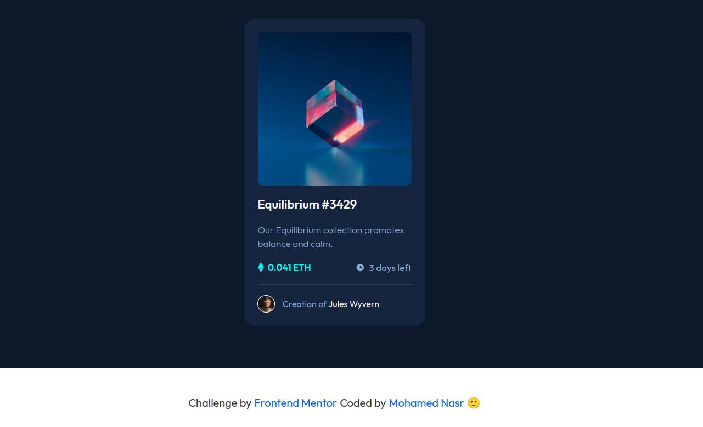
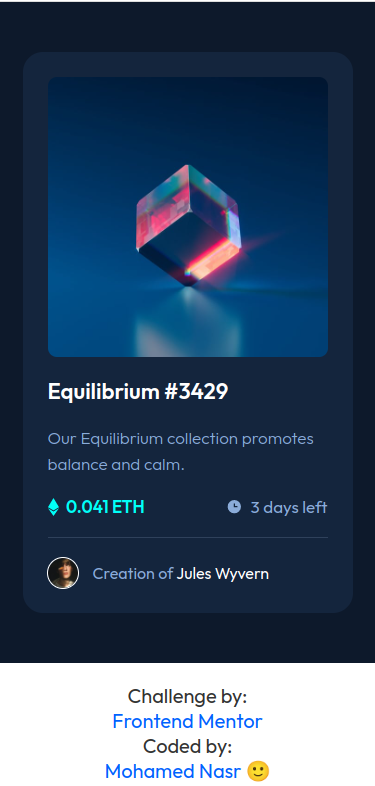
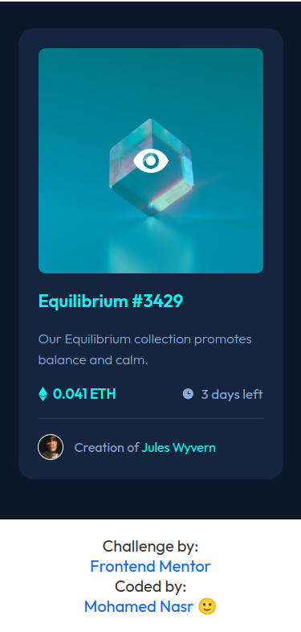

# Frontend Mentor - NFT preview card component solution

This is a solution to the [NFT preview card component challenge on Frontend Mentor](https://www.frontendmentor.io/challenges/nft-preview-card-component-SbdUL_w0U). Frontend Mentor challenges help you improve your coding skills by building realistic projects.

## Table of contents

- [Overview](#overview)
  - [The challenge](#the-challenge)
  - [Screenshot](#screenshot)
  - [Links](#links)
- [My process](#my-process)
  - [Built with](#built-with)
  - [What I learned](#what-i-learned)
  - [Useful resources](#useful-resources)
- [Author](#author)

## Overview

### The challenge

Users should be able to:

- View the optimal layout depending on their device's screen size
- See hover states for interactive elements

### Screenshot





### Links

- Solution URL: [Github](https://github.com/monasr1997/nft-preview-card-component-main)
- Live Site URL: [Add live site URL here](https://your-live-site-url.com)

## My process

### Built with

- Semantic HTML5 markup
- CSS custom properties
- Flexbox
- Mobile-first workflow

### What I learned

I enjoyed writing this code to match multiple background when hover.

```css
.hero-img {
  width: 28rem;
  height: 28rem;
  background-image: url(images/image-equilibrium.jpg);
  background-size: contain;
  border-radius: 9px;
  position: relative;
}
.hero-img:hover {
  background-image: linear-gradient(
      hsl(178, 100%, 50%, 0.4),
      hsl(178, 100%, 50%, 0.4)
    ), url(./images/image-equilibrium.jpg);
  cursor: pointer;
}
.hero-img:hover::after {
  content: "";
  width: 4.8rem;
  height: 4.8rem;
  background-image: url(./images/icon-view.svg);
  position: absolute;
  top: 50%;
  left: 50%;
  transform: translate(-50%, -50%);
}
```

### Useful resources

- [MDN web Docs](https://developer.mozilla.org/en-US/)

## Author

- Website - [Mohamed Nasr](https://linkedin.com/in/monasr1997)
- Frontend Mentor - [@monasr1997](https://www.frontendmentor.io/profile/monasr1997)
- Twitter - [@monasr1997](https://www.twitter.com/monasr1997)
